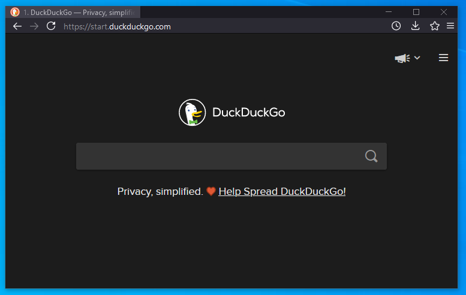
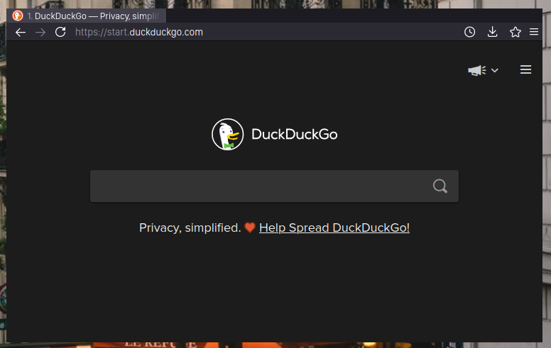

## ff

`ff` is an opiniated, minimal stylesheet for Firefox Linux and Windows. It features:
- Lots of hidden visual components, or reduced by size
- Some buttons like tab close and new tab only appears on hover
- menus are simplified, some items are removed for a cleaner look
- Seemless URL bar with no placeholder text
- Good comments in the CSS, should you choose to customize it

### Installation

1. Copy userChrome.css to the chrome folder under your firefox profile.
    - Windows: `%AppData%\Mozilla\Firefox\Profiles\xxxxxx.default\chrome`
    - Linux: `~/.mozilla/firefox/xxxxxx.default/chrome`
3. Enable `toolkit.legacyUserProfileCustomizations.stylesheets` under `about:config`

### Previews

Windows:

Linux:

